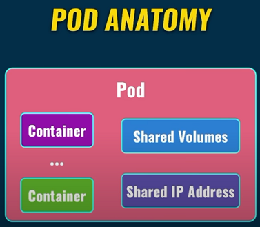
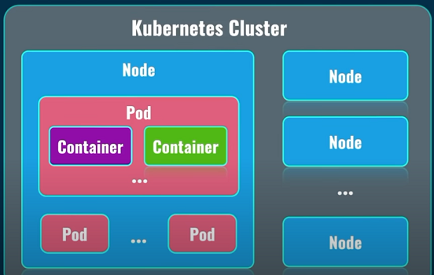
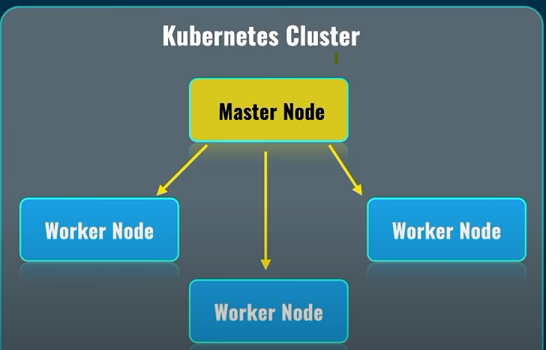
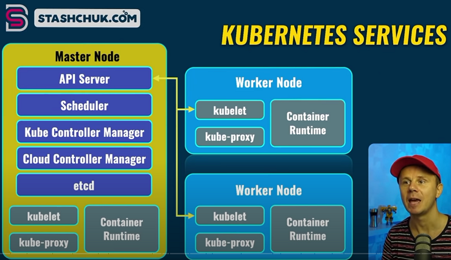
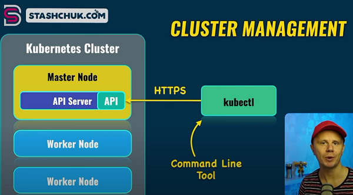
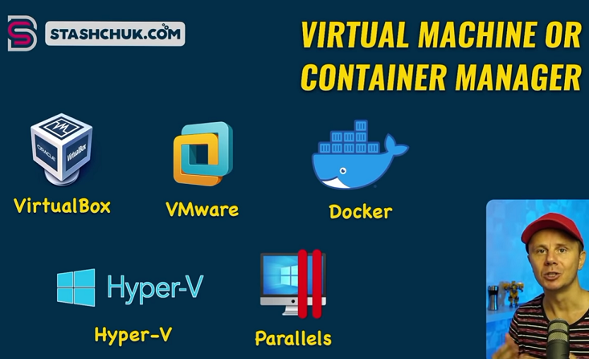
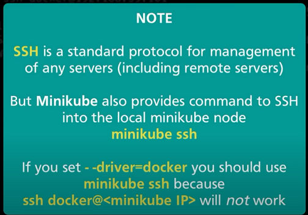
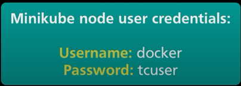

# Kubernetes Course

## What is Pod




## Kubernetes cluster and Nodes








## What is Kubectl

## [Instalar Kubectl](https://kubernetes.io/docs/tasks/tools/install-kubectl-windows/)

La herramienta de línea de comandos de Kubernetes **kubectl** , le permite ejecutar comandos en clústeres de Kubernetes.



[Herramientas para trabajar con kubernetes](https://kubernetes.io/docs/tasks/tools/)

```sh
# Version kubectl
kubectl version --client --output=yaml
```


## [Instalar Minikube](https://minikube.sigs.k8s.io/docs/start/)

Create Kubernetes cluster with single node

minikube configura rápidamente un clúster local de Kubernetes en macOS, Linux y Windows.

minikube es Kubernetes local y se centra en facilitar el aprendizaje y el desarrollo para Kubernetes.

Administrador de contenedores o máquinas virtuales, como: Docker , Hyperkit , Hyper-V , KVM , Parallels , Podman , VirtualBox o VMware Fusion/Workstation




## Creating kubernetes cluster using Minikube

```sh
# Show version minikube
minikube version

# Show help minikube
minikube help

# Start local cluster
minikube start

# Start minikube using the driver specified
minikube start --driver=virtualbox

# Show dashboard minikube
minikube dashboard

# Status minikube
minikube status

# Show ip
minikube ip

# Connect by ssh to minikube
ssh docker@<minikube_ip>
minikube ssh

# Exit ssh minikube
exit
```

[Usar otros drivers](https://minikube.sigs.k8s.io/docs/drivers/)





# Kubectl 

## [cheatsheet](https://kubernetes.io/docs/reference/kubectl/cheatsheet/)

```sh

kubectl cluster-info

kubectl get nodes
kubectl get pods
kubectl get namespaces

kubectl get pods --namespace=kube-system
```

## Creating just single Pod

```
kubectl run nginx --image=nginx

kubectl describe pod nginx
```

## Exploring Kubernetes Pod

```sh
minikube ssh
docker ps | grep nginx

# copy ID docker
docker exec -it <id_docker> sh

hostname
nginx
hostname -i
172.17.0.3

curl 172.17.0.3

exit
exit

kubectl get pods -o wide

kubectl delete pod nginx
kubectl get pods
```

## Creating alias for the kubectl command

```sh
# Usar git-bash in Windows
alias k="kubectl"

# get pods wit alias
k get pods
```

## Creating and exploring deployment

```sh
k get pods

k create deployment nginx-deployment --image=nginx

k get deployments
k get pods

k describe deployment nginx-deployment

k get pods
k describe pod nginx-deployment-6fc794585d-76mpm

k scale deployment nginx-deployment --replicas=5

k get deployments
k get pods

kubectl get pods -o wide

```

## Creating and exploring deployment

```sh
k expose deployment nginx-deployment --port=8080 --target-port=80

k get services
k get svc
```

## Delete deployments and services

```sh
k get deployments
k get svc

k delete deployment nginx-deployment
k delete service nginx-deployment

k get deploy
k get svc

```

## Dockerizing app Node

```sh
# Create app Node
npm init -y

# Create Dockerfile

# build image
docker build . -t cvargas9304/k8s-web-hello

# show docker image
docker images | grep k8s-web-hello

# Push docker image
docker push cvargas9304/k8s-web-hello
```